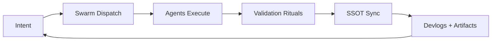

<!--
Victor Dixon — GitHub Profile README
Drop this into: /README.md on your profile repo (Victor-Dixon/Victor-Dixon)
Replace links + repo names where needed.
-->

# ⚔️ Victor Dixon
### Architect of autonomous swarms… building systems that build themselves.

 

<!-- Badges -->

  

<!-- WOW one-liner -->
> **I don’t “code” projects… I engineer ecosystems that self-correct, self-coordinate, and ship.**

 

<!-- GitHub Stats (swap username if needed) -->

---

## 🧠 What I build
I’m building **Dream.OS**… a self-healing automation engine that runs **multi-agent swarms** inside Cursor via `.prompt.md` pipelines.

- **Swarm Execution:** 8+ agents acting in parallel (with escalation only on real blockers)
- **Governance:** SSOT, validation rituals, test gates, drift prevention
- **Reliability:** “act → self-correct → converge” feedback loops
- **Outcome:** faster iteration **without** turning the codebase into a landfill

---

## 🪄 WOW FACTOR
### ✅ I ingested and unlocked **1,310** ChatGPT conversations into a pipeline for:
- **SQLite memory nexus**
- searchable episode indexing
- resume + project extraction
- narrative “MMORPG-style” progression tied to real work

If you want the future of software… it’s **memory + orchestration + guardrails**.

---

## 🔥 The loop

---

## 🧰 Active Systems
- Dream.OS / WeAreSwarm — agent orchestration + self-healing automation
- Memory Nexus — SQLite + JSON tiered memory manager
- Validation Rituals — domain test suites gating stabilization
- Agent Cell Phone — PyAutoGUI-based inter-agent comms inside Cursor
- Trading Journal Engine — structured logs → analytics → strategy evolution

Want a “single command” that bootstraps order out of chaos… that’s my lane.

---

## 🧪 Principles (non-negotiable)
- Closure-first: every session ends with a clean next action
- No drift: systems evolve, they don’t sprawl
- No fragile magic: validate, test, log, repeat
- Automation wins: manual work is a bug

---

## 🛰️ Featured Repos
- Dream.OS: https://github.com/Victor-Dixon/Dream.os
- (Add more here): put your top 3 revenue / flagship builds

---

## 📌 Quick link hub
- Website / Hub: (add)
- Twitter / X: (add)
- YouTube / Twitch: (add)
- Discord: (add)

---

<b>📎 “If you only read one thing…”</b>

I’m not chasing “better prompts.”
I’m building operational leverage: systems that keep moving even when the UI changes, requirements shift, or humans get tired.

If you’re building in the real world… you need orchestration, validation, and memory.

