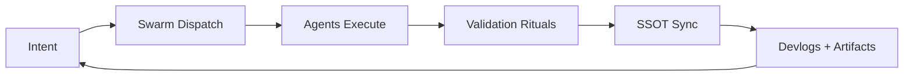

<!--
Victor Dixon — GitHub Profile README
Drop this into: /README.md on your profile repo (Victor-Dixon/Victor-Dixon)
Replace links + repo names where needed.
-->

<h1>⚔️ Victor Dixon</h1>
<h3>Architect of autonomous swarms… building systems that build themselves.</h3>

 
<!-- Badges -->

 
<!-- Shipping signals -->

  

<!-- WOW one-liner -->
<strong>I don’t “code” projects… I engineer ecosystems that self-correct, self-coordinate, and ship.</strong>

 

---

## 🧠 What I build
I’m building **Dream.OS**… a self-healing automation engine that runs **multi-agent swarms** inside Cursor via `.prompt.md` pipelines.

- **Swarm Execution:** 8+ agents acting in parallel (with escalation only on real blockers)
- **Governance:** SSOT, validation rituals, test gates, drift prevention
- **Reliability:** “act → self-correct → converge” feedback loops
- **Outcome:** faster iteration **without** turning the codebase into a landfill

---

## 🚀 Start here
- **Watch a 2-min demo:** request the private link → https://github.com/Victor-Dixon/Dream.os/issues/new?title=Demo%20request
- **Read the architecture overview:** Dream.OS README → https://github.com/Victor-Dixon/Dream.os#readme
- **Try the flagship repo:** Dream.OS → https://github.com/Victor-Dixon/Dream.os

---

## 🪄 WOW FACTOR
### ✅ I ingested and unlocked **1,310** ChatGPT conversations into a pipeline for:
- **SQLite memory nexus**
- searchable episode indexing
- resume + project extraction
- narrative “MMORPG-style” progression tied to real work

If you want the future of software… it’s **memory + orchestration + guardrails**.

---

## 🔥 The loop

---

## 🧰 Active Systems
- Dream.OS / WeAreSwarm — agent orchestration + self-healing automation
- Memory Nexus — SQLite + JSON tiered memory manager
- Validation Rituals — domain test suites gating stabilization
- Agent Cell Phone — PyAutoGUI-based inter-agent comms inside Cursor
- Trading Journal Engine — structured logs → analytics → strategy evolution

Want a “single command” that bootstraps order out of chaos… that’s my lane.

---

## 🧪 Principles (non-negotiable)
- Closure-first: every session ends with a clean next action
- No drift: systems evolve, they don’t sprawl
- No fragile magic: validate, test, log, repeat
- Automation wins: manual work is a bug

---

## 🤝 How to work with me
- **Open to:** consulting/advisory, multi-agent orchestration, automation pipelines, validation guardrails
- **Best contact:** open a short issue in Dream.OS → https://github.com/Victor-Dixon/Dream.os/issues/new
- **Include:** goal, current stack, timeline, constraints, and success metric

---

## Featured Repos (Start Here)
- Dream.OS — multi-agent orchestration + self-healing automation: https://github.com/Victor-Dixon/Dream.os
- Thea — gamified agent training + MMORPG mechanics: https://github.com/Victor-Dixon/Thea
- SWARM — enterprise swarm orchestration platform: https://github.com/Victor-Dixon/SWARM
- ProjectScanner — repo scanning → structured reports for audits/portfolios: https://github.com/Victor-Dixon/projectscanner
- MeTuber — YouTube automation + channel ops platform: https://github.com/Victor-Dixon/MeTuber
- Auto_Blogger — WordPress automation + content generation: https://github.com/Victor-Dixon/Auto_Blogger
- AgentTools — scripts/utilities for automation + infra: https://github.com/Victor-Dixon/AgentTools

---

## Project Index (Everything Else)
- Portfolio hub (27 projects): https://github.com/Victor-Dixon/victor-dixon-portfolio

---

## Project Buckets (quick map)
- Content Ops: MeTuber, Streamertools, socialmediamanager, Auto_Blogger
- Security: network-scanner
- ML: machinelearningmodelmaker, LSTMmodel_trainer
- Biz Automation: contract-leads
- Games/Worldbuilding: HCshinobi, Superpowered-TTRPG, Mods
- Utilities: Flowr, organizer-validation, FocusForge

---

## 🔗 Links
- **Hub / Portfolio:** https://github.com/Victor-Dixon/victor-dixon-portfolio
- **GitHub:** https://github.com/Victor-Dixon
- **Contact (issues):** https://github.com/Victor-Dixon/Dream.os/issues/new

---

<b>📎 “If you only read one thing…”</b>

I’m not chasing “better prompts.”
I’m building operational leverage: systems that keep moving even when the UI changes, requirements shift, or humans get tired.

If you’re building in the real world… you need orchestration, validation, and memory.

